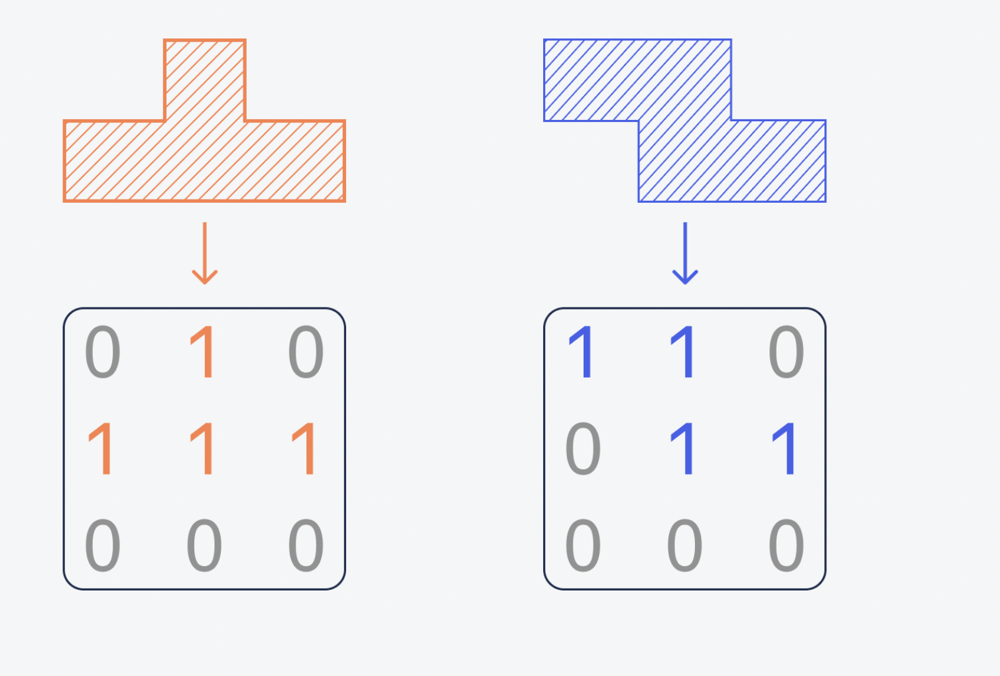

# Tetris
# The goal of Tetris is to score as many points as possible by clearing horizontal lines of Blocks. The player must rotate, move, and drop the falling Tetriminos inside the Matrix (playing field). Lines are cleared when they are filled with Blocks and have no empty spaces.
As lines are cleared, the more space is created and Tetriminos continue to fall in sequence. If the Blocks land above the top of the playing field, the game is over. 
There are seven shapes ("I", "O", "Z", "T", "J", "S", "I")

# wireframe <src https://docs.google.com/presentation/d/1ijeoRMLFRBWTlDyZ_L0a0X2ebhG2KEX-TDVHfzH3x0s/edit#slide=id.p>
HTML element Canvas is used to draw the shapes. Shapes are generated in nested arrays. Javascript is used for movements of shapes and clearing the rows, generating the shapes, coloring shapes and showing that the game is over when all sheps are stucked over each other and no more rows to draw the shapes. Javascript Key Code is used for rotating the shapes. CSS is used to give the measures to canvas and backgbround image. 

Hosted site:  https://ainurpro.github.io/TetrisProject/ 